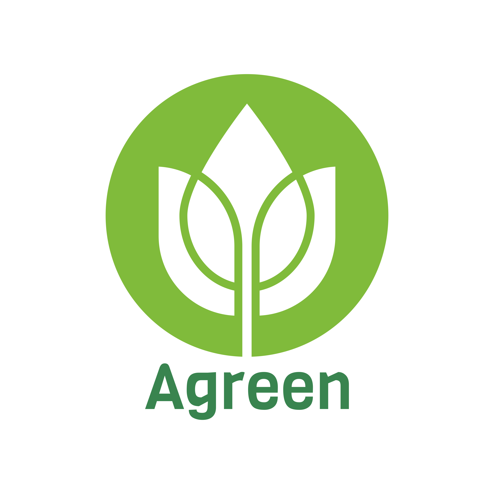

# Agreen Solutions

Perdas de alimentos são um problema que tem grande impacto na sustentabilidade dos 
sistemas alimentares, e a perda da hortaliça no processo da pós-colheita, causam grandes prejuízos para toda a cadeia de abastecimento, além da perda para o comprador. E foi olhando esse problema que a nossa empresa, Agreen Solutions, surgiu.
Somos uma empresa de tecnologia que tem como objetivo desenvolver soluções digitais focadas em monitorar 
a temperatura e umidade do ar nos sistemas alimentares, durante sua cadeia de 
abastecimento, com objetivo de reduzir as perdas de nossos clientes.

## Documentação de cores

| Cor               | Hexadecimal                                                |
| ----------------- | ---------------------------------------------------------------- |
| Cor exemplo       |  #80bb3b |
| Cor exemplo       |  #bddc3f |
| Cor exemplo       |  #39844f |
| Cor exemplo       |  #7fba3c |

## Autores

- [@alanaquinoslv](https://github.com/alanaquinoslv)
- [@gabrielfernado23](https://github.com/gabrielfernando23)
- [@leonardosantosborges](https://github.com/leonardosantosborges)
- [@bsouzaluan](https://github.com/bsouzaluan)
- [@LucasSouza1407](https://github.com/LucasSouza1407)
- [@pauloAlmeida01](https://github.com/pauloAlmeida01)